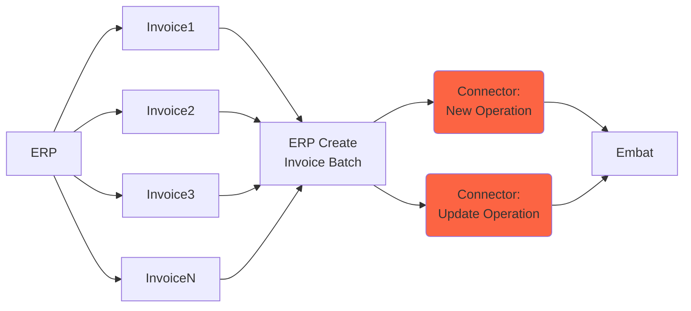
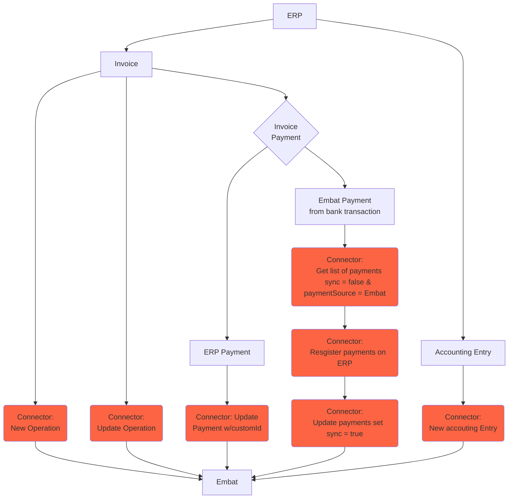

Some entities require continuous updates as changes occur in the ERP. These **recurring loads** ensure that Embat always has the latest data to maintain accuracy and consistency across financial operations.

Whenever an entity is modified in the ERP—whether it's a new operation, an updated accounting entry, or a change in a contact—these updates must be sent to Embat in real time or at regular intervals.

In this section, we will go through the different entities that require recurring synchronization, how they should be structured, and the best practices to ensure a smooth and reliable data flow.


<Steps>
  <Step title="Operations">
    `Operation` object represents any of accounting operations. For example, an operation represents a due into an invoice, but if the invoice has multiple dues, there are multiple operations.`customId` represents the unique id of an operation into Embat and you can use the field to put your ERP custom id when you create an operation or if you leave it empty Embat will auto-generate it.

In most of the ERPs, it is possible to create a batch of invoices, when that happens a new `operation` needs to be created in Embat with the type `invoiceGroup` .

A connector should cover these scenarios:

- Import an initial set of invoices into Embat
- Update invoice data
- Create a batch from a group of invoices
- Add an invoice into an existing batch
- Remove an invoice from an existing batch
- Delete an invoice
- Delete a batch of invoices

### Update invoice data

If an invoice is updated in the ERP, for example, when the amount or due date changes, you need to send an update of the operation using the `customId` via the [Update operation](/api/erp/operations/update-operation) endpoint. If you need to update multiple invoices at once, you can use the bulk endpoint: [Update operations bulk](/api/erp/operations/update-operations-bulk).

### Create a batch from a group of invoices

When a new batch of invoices is created on the ERP you need to send the information to Embat in the form of operation. You can use the endpoint

[Create operation](https://api.embat.io/docs#tag/Operations/operation/create_operation_operations__companyId__post)


The field `operationsCustomIds` will contain all the operation customIds that are part of that batch.

When a new batch is created, the operations that are part of the batch will be updated with `status = paid`  and `pendingAccountingAmount = 0`  automatically.

### Add or remove an invoice from an existing batch

If an invoice is added or removed from an existing batch, the operation need to be updated accordingly. In order to do that you should use the endpoint

`PATCH` - [Update operation](https://api.embat.io/docs#tag/Operations/operation/update_operation_operations__companyId___customId__patch)


⚠️ When you send an update to add or remove operations from a batch, the field `operationsCustomIds` must contain all the `customId` of the batch not only the only the modified ones.


In case you need to modify multiple batches you should use the endpoint:

`PATCH` - [Update operations bulk](https://api.embat.io/docs#tag/Operations/operation/update_operations_bulk_operations__companyId__patch)




### Delete an invoice

When an invoice is deleted on the ERP the operation need to be updated accordingly in Embat. In order to do that you should use the endpoint:

`DELETE` - [Delete operation](https://api.embat.io/docs#tag/Operations/operation/delete_contact_operations__companyId___customId__delete)


When we receive the deletion request, the `operation` will be move to status `cancel` .

In case you need to delete multiple invoices you should use the endpoint:

`DELETE` - [Delete operations bulk](https://api.embat.io/docs#tag/Operations/operation/delete_contacts_bulk_operations__companyId__delete)


In case the operation refer to a batch (`documentType = invoiceGroup`) the operation is set to status `cancel` and all the `operationsCustomIds`  will be moved to `pending`  or `overdue` state.


⚠️

Only operations that are not in status `paid` or `payment_in_progress` can be deleted. If you send a request to delete an operation with one of those two status you will receive an error code `405`.


  </Step>
  <Step title="Payments">
As we said in the introduction, payments are bidirectional. therefore the erp through the connector will get and will send information to embat.
Therefore the connector should be able to create payments and send them to embat, not just getting payments.
It should be able to create a payment made directly to an accounting account. (cuando involves a 572.)

once we have all the accounting accounts and documents in embat, we can start making accounting registriess

this is done through the payment entity, and it represents a match between a bank transaction and a operation or an accounting account
this is because there are document-backed accounting registries such as invoices and non-document backed registries such as interests or payroll 

The Payment entity is the union between bank world and accounting world into Embat. It represents any type of payments and its unique id is the `customId` . You can use your internal ERP id as `customId` .

A payment represent the relationship between a `transaction` and an `operation` .

A connector should be able to:

- Create a payment related to an invoice
- Create a payment made directly to an account
- Create a counterparty payment
- Create bulk payments
- Get payments made in Embat and update them on the ERP
- Log an error during the payment sync process
- Update a payment in Embat when is removed in the ERP

### Create a payment related to an invoice

When an invoice payment is made on the ERP, the connector must inform Embat about it. All the operations linked to the payments should be part of the object sent. It should use the endpoint: 

`POST` - [Create payment](https://api.embat.io/docs#tag/Payments/operation/create_payment_payments__companyId__post)


When an invoice is paid, the connector should also update the linked operations to it, changing its status to `paid` or `payment_in_progress` accordingly.

### Create a payment made directly to an account

Using the same endpoint as before, the ERP must update Embat when the payment is made directly to a bank account. In this case apart from the operations it should send the `productId`.

### Create a counterparty payment

In case the payment is made to a counterparty, the connector should send the `contactCustomId`.

### Create bulk payments

When multiple payments are communicated to Embat, the connector should use the endpoint: 

`POST` - [Create payments bulk](https://api.embat.io/docs#tag/Payments/operation/create_payments_bulk_payments__companyId__bulk_post)


### Get payments made in Embat and update them on the ERP

When the payments are made in Embat the connector should record them on the ERP. This is a multi step process.

1. Get payments not synced yet from Embat (recurring process, repeat every 10 minutes)

`GET` - [List payments](https://api.embat.io/docs#tag/Payments/operation/list_payments_payments__companyId__get)


The connector should filter by the `sync = false` and `paymentSource = Embat` .

1. Update the payments with `sync = true` 

When the payments are correctly registered on the ERP, the connector should update them in Embat with `sync = true` using the endpoint:

`PATCH` - [Update payments](https://api.embat.io/docs#tag/Payments/operation/update_payment_payments__companyId___customId__patch)


Ideally, the connector should insert all the payments in the ERP and then update them in bulk in Embat with the endpoint:

`PATCH` - [Update payments in bulk](https://api.embat.io/docs#tag/Payments/operation/update_payments_bulk_payments__companyId__patch)


It is important to persist the Embat payment id `id` or the `transactionId` of the payments received as they will be needed for the accounting process.

1. Send the generated accounting entries Embat

Using the same process described [here](https://www.notion.so/Integration-Guide-Connect-Your-ERP-with-Embat-4fb442cfd0714d69a40bf778e1c5b37b?pvs=21) the connector should send the new accounting entries generated from those payments to Embat. Automatically, Embat will link the new entries to the payment using the `id` or the `transactionId`.

### Log an error during the payment sync process

In case the creation of the payments in the ERP fails, the payment should be updated in Embat leaving the `sync = false` and logging the error on the `error` field.

### Update a payment in Embat when is removed in the ERP

When a payment is deleted in the ERP the connector should use the endpoint to update Embat:

`DELETE` - [Delete payment](https://api.embat.io/docs#tag/Payments/operation/delete_payment_payments__companyId___customId__delete)


In case multiple payments are deleted at the same time, the connector should use the bulk endpoint and send only one request:

`DELETE` - [Delete payments bulk](https://api.embat.io/docs#tag/Payments/operation/delete_payments_bulk_payments__companyId__delete)




  </Step>
  <Step title="Accounting entries">
    
    
El conector tiene que ser capaz de coger un accounting account y exportar todas sus accounting entries en embat. 
Esto es importante para la reconciliación. 


An `AccountingEntry` object represents an entry in an accounting account.

The unique identifier of an accounting entry is `customId`. You can use it as your ERP accounting entry Id.

A connector should be able to:

- Ingest a set of accounting entries
- Create a single accounting entry
- Update an existing accounting entry
- Delete an existing accounting entry

### Initial load of accounting entries


ℹ️ As part of the initial configuration, it is needed that given a start date, the connector export all the bank type entries to Embat.


The initial load of accounting entries from a start date can be done using the bulk endpoint:

`POST` - [Create accounting entries bulk](https://api.embat.io/docs#tag/AccountingEntries/operation/create_accounting_entries_bulk_accountingentries__companyId__bulk_post)


### Create a single accounting entry

All accounting entries need to be in sync between the ERP and Embat. When a new accounting entry is created in the ERP, it needs to be sent to Embat using the endpoint:

`POST` - [Create accounting entry](https://api.embat.io/docs#tag/AccountingEntries/operation/create_accounting_entry_accountingentries__companyId__post)


### Update an existing accounting entry

When an accounting entry is modified in the ERP, the updated data needs to be sent to Embat using the endpoint:

`PATCH` - [Update accounting entry](https://api.embat.io/docs#tag/AccountingEntries/operation/update_accounting_entry_accountingentries__companyId___customId__patch)


It is also possible to update multiple accounting entries in one request using the endpoint:

`PATCH` - [Update accounting entries in bulk](https://api.embat.io/docs#tag/AccountingEntries/operation/update_accounting_entries_bulk_accountingentries__companyId__patch)


### Delete an existing accounting entry

When an accounting entry is deleted in the ERP, it needs to be sent to Embat using the endpoint:

`DELETE` - [Delete accounting entry](https://api.embat.io/docs#tag/AccountingEntries/operation/delete_accounting_entry_accountingentries__companyId___customId__delete)


In case multiple accounting entries are deleted in the ERP you should use the endpoint:

`DELETE` - [Delete accounting entries in bulk](https://api.embat.io/docs#tag/AccountingEntries/operation/delete_accounting_entries_bulk_accountingentries__companyId__delete)


There is also the possibility to delete all the accounting entries that are linked to an specific `accountingEntryCode` (internal accounting id). For that you can use the endpoint:

`DELETE` - [Delete accounting entries using the accounting entry internal Id](https://api.embat.io/docs#tag/AccountingEntries/operation/delete_accounting_entries_bulk_accountingentries_accountingentrycode__companyId__delete)

  </Step>
  <Step title="Contacts">
    
    
A `Contact` object represents any client, supplier or provider of operations.  `customId` represents unique key to Embat contacts and you can use the field to put your ERP custom id when you crebringate a contact.

The contacts from the ERP should be sent to Embat and keep them in sync.

A connector should be able to:

- Ingest all the contacts that are available in the ERP
- Create a single contact in Embat when a contact is created on the ERP
- Update an existing contact in Embat when a contact is updated on the ERP
- Delete an existing contact in Embat when a contact is deleted on the ERP

### Initial load

To create multiple contacts you should use the endpoint:

`POST` - [Create contacts bulk](https://api.embat.io/docs#tag/Contacts/operation/create_contacts_bulk_contacts__companyId__bulk_post)

```html
/contacts/{companyId}/bulk
```

If there is already a contact with the same `customId` the information of the existing contact will be updated.

### Create contact

When a new contact is added on the ERP it should be register in Embat. 

To create a single contact you should use the endpoint:

`POST` - [Create contact](https://api.embat.io/docs#tag/Contacts/operation/create_contact_contacts__companyId__post)

```html
/contacts/{companyId}
```

On the same way as in the bulk operation, if there is already a contact with the same `customId` the information of the existing contact will be updated.

### Update contact

Any change on a contact should be populated to Embat.

To update a single contact you should use the endpoint:

`PATCH` - [Update accounting account](https://api.embat.io/docs#tag/AccountingAccounts/operation/update_accountings_account_accountingaccounts__companyId___accountingCode__patch)

```html
/contacts/{companyId}/{customId}
```

### Delete contact

If a contact is deleted on the ERP, Embat will mark that account as inactive and from that moment it will not be possible to make any accounting process on it.

To create a single accounting account you should use the endpoint:

`DELETE` - [Delete accounting account](https://api.embat.io/docs#tag/AccountingAccounts/operation/delete_accountings_account_accountingaccounts__companyId___accountingCode__delete)

```html
/contacts/{companyId}/{customId}
```

✅ Expected result

The complete list of contacts should be available on the company configuration in Embat.

Go to `Company Settings`  → `ERP Configuration` → `Contacts`


  </Step>
</Steps>


